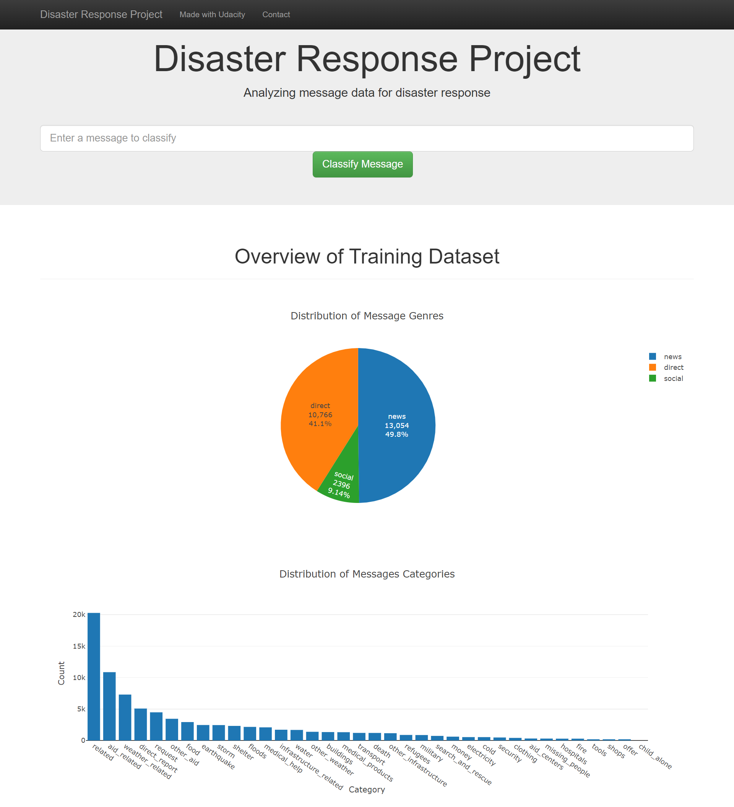
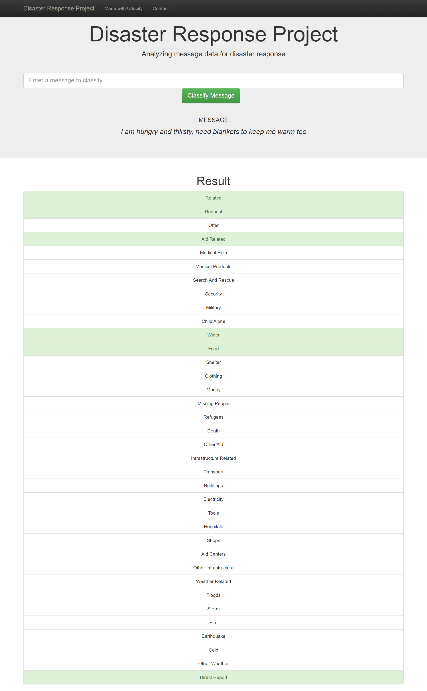
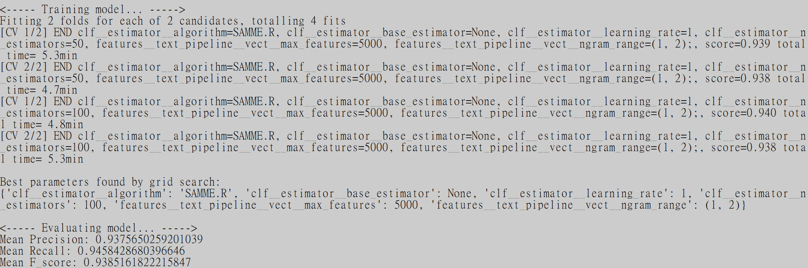
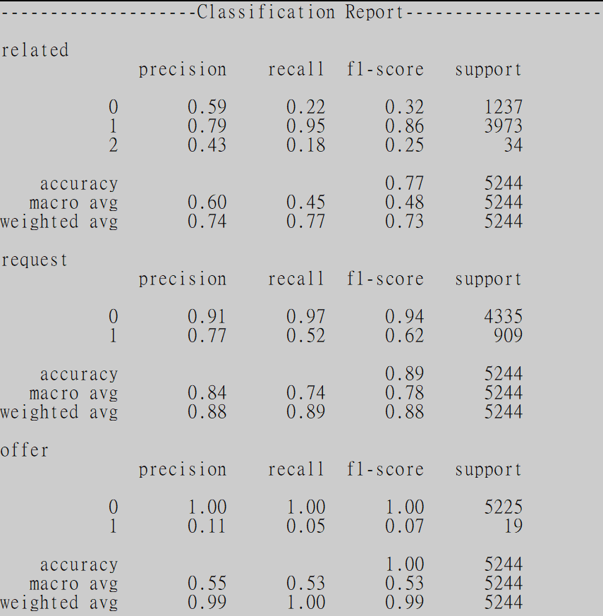

# Disaster Response Pipeline Project


## Table of Contents
1. [Project Overview](#1-project-overview)
2. [Project Details](#2-project-details)
3. [File Structure & Description](#3-file-structure--description)
4. [Instructions for getting started](#4-instructions-for-getting-started)
	1. [Cloning](#41-cloning)
	2. [Dependencies](#42-dependencies)
	3. [Executions](#43-executions)
5. [Screenshots of web application](#5-screenshots-of-web-application)
6. [Screenshots of model training results](#6-screenshots-of-model-training-results)


## 1. Project Overview
This project is part of the Data Science Nanodegree Program by Udacity in collaboration with Figure Eight. 

During disaster events, emergency operation centres are usually overwhelmed with messages of various requests. Processing all of them manually could cause slow responses. Thus, Natural language processing (NLP) and machine learning are adopted to build a model for an API that classifies messages during disaster events so that appropriate disaster relief agencies could be informed earlier. 

**Dataset:** 
The dataset is provided by [Figure Eight](https://www.figure-eight.com/data-for-everyone/). It contains more than 26k pre-labelled messages sent during real-life disaster incidents (either via social media or directly to disaster relief organizations).  There are 36 pre-defined categories, and "Aid Related", "Shelter", and "Missing People" are some of the examples. In addition, the initial dataset includes the original messages, the English version of messages and the corresponding genres (direct, news, social).


**Deliverables:**
1. Extract Transform Load(ETL) Pipeline:
    Complete the ETL script for data extracting , data cleaning and SQLite database creation


2. Machine Learning(ML) Pipeline:
    Complete the ML script to creates the disaster message classifier


3. Flask Web App:
    Build a web application that displays visualizations regarding the dataset and outputs the classification results based on the user's input in real time.


## 2. Project Details
- ETL Pipeline:
    - Loads and merges the messages and categories datasets
    - Cleans the categories part of the dataset with pandas 
    - Stores clean data in a SQLite database with the SQLAlchemy engine


- ML Pipeline:
    - Loads data from the SQLite database created by the ETL pipeline
    - Splits the dataset into training and test sets with the ratio of 8:2
    - By the package, `nltk`, builds a text processing pipeline which:
        - Cleans and tokenizes each message into seperated words
        - Lemmatizes them to further reduce the complexity of features
        - Vectorizes the text data by computing the Bag of Words and TF-IDF values for feature extraction
        - Extracts the text feature with the custom tranformer, `StartingVerbExtractor`
        - Performs feature union of the above feature extraction processes
    - Combine the feature extraction pipeline with the `AdaBoostClassifier`
    - Trains and tunes a model using scikit-learn's `GridSearchCV`
    - Outputs metrics(precision, recall, F1-score) of the test set
    - Exports the best model as a pickle file


- Flask Web App: 
    - With the help of Pandas and Plotly, two data visualizations are created


## 3. File Structure & Description
~~~~~~~
|-- app
    |-- templates
        |-- go.html # main page of web app
        |-- master.html # classification result page of web app
    |-- utils
        |-- custom_scorer.py
        |-- custom_transformer.py
        |-- plotting.py # to return figures for flask web app
    |-- run.py # Flask file that runs app
|-- data
    |-- DisasterResponse.db # database to save clean data
    |-- disaster_categories.csv # categories data to process
    |-- disaster_message.csv # message data to process
    |-- process_data.py # ETL script that takes .csv as input, cleans data and stores them into SQLite database
|-- images
    |-- DisasterResponse.db # database to save clean data
    |-- disaster_categories.csv # categories data to process
    |-- disaster_message.csv # message data to process
|-- models
    |-- classifier.pkl # saved model
    |-- train_classifier.py # machine learning script that creates and trains a classifier, and stores the classifier into a pickle file
|-- README.md
|-- requirements.txt # list of necessary python packages
~~~~~~~


## 4. Instructions for getting started
### 4.1. Cloning
To run the code locally, create a copy of this GitHub repository by running the following code in terminal:
```sh
git clone https://github.com/timchansdp/Disaster-Response-Pipelines.git
```

### 4.2. Dependencies
The code is developed with Python 3.9.1 and is dependent on python packages listed in `requirements.txt`. To install required packages, run the following command in the project's root directory:
```sh
pip install -r requirements.txt
```

### 4.3. Executions
- Run the following command in the `data` directory to clean the data and load them as database:
    ```sh
    python process_data.py disaster_messages.csv disaster_categories.csv DisasterResponse.db
    ```
    
- Run the following command in the `models` directory to run machine learning pipeline that trains classifier and saves model:
    ```sh
    python train_classifier.py ../data/DisasterResponse.db classifier.pkl
    ```
    
- Run the following command in the `app` directory to launch the web app: 
    ```sh
    python run.py
    ```
    Go to http://0.0.0.0:3001/ when the web app starts running.


## 5. Screenshots of web application
- **Homepage**

    The home page shows two plots, distribution of message genres and   distribution of message categories, about the dataset

    
    
- **Classification result page**

    It is an example of the classification result of the inputed message. The categories which the message is classified as are highlighted in green.

    
    


## 6. Screenshots of model training results
    
- Below shows the verbosity of the grid search process, the best found parameters and metrics of the model refitted with the best parameters respectively.
    
        

- Below shows the classification reports of three catergories, 'related', 'request' and 'offer'.

        
